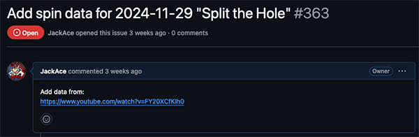
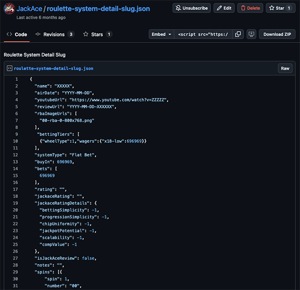

# Roulette-System-Catalog-Data-Entry-Guidelines

This repository is the set of guidelines for updating the Roulette System Catalog available on [jackace.com](https://www.jackace.com/gambling/roulette/systems/).

## Repository

The GitHub respository you should be working from is [staging.jackace.com](https://github.com/JackAce/staging.jackace.com).

## Issues (Work Queue)

The queue for systems that need to be added are found in the Issues tab for the [staging.jackace.com repository on GitHub]([https://github.com/JackAce/staging.jackace.com](https://github.com/JackAce/staging.jackace.com/issues?q=is%3Aissue+is%3Aopen+Add+spin+data+sort%3Acreated-asc)).

Filter this list on "Add spin data" and sort the list by oldest first.

Click on the link for the issue to see the details.

### Issue Details

In the Issue Details, you should find the following:
* System Name
* Air Date
* YouTube URL of video reviewed

In the example above, this corresponds to 
* System Name: "Split the Hole"
* Air Date: "2024-11-29"
* YouTube URL: "https://www.youtube.com/watch?v=FY20XCfKIh0"

## JSON Item Template (Gist)

You can copy a template of a Roulette System item from the following [Gist](https://gist.github.com/JackAce/45ffe199d1c9a58a8ceaf3a87ebbd0a4).

