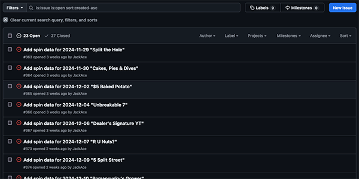

# Roulette-System-Catalog-Data-Entry-Guidelines

This repository is the set of guidelines for updating the Roulette System Catalog available on [jackace.com](https://www.jackace.com/gambling/roulette/systems/).

## Repository

The GitHub respository you should be working from is [staging.jackace.com](https://github.com/JackAce/staging.jackace.com).

## Issues (Work Queue)

The queue for systems that need to be added are found in the Issues tab for the [staging.jackace.com repository on GitHub](https://github.com/JackAce/staging.jackace.com/issues?q=is%3Aissue+is%3Aopen+Add+spin+data+sort%3Acreated-asc).

Filter this list on "Add spin data" and sort the list by oldest first.

Click on the link for the issue to see the details.

### Issue Details

In the Issue Details, you should find the following:
* System Name
* Air Date
* YouTube URL of video reviewed

In the example above, this corresponds to 
* System Name: "Split the Hole"
* Air Date: "2024-11-29"
* YouTube URL: "https://www.youtube.com/watch?v=FY20XCfKIh0"

## JSON Item Template (Gist)

You can copy a template of a Roulette System item from the following [Gist](https://gist.github.com/JackAce/45ffe199d1c9a58a8ceaf3a87ebbd0a4).

## Inserting a new JSON element

Insert the Gist into the correct `data` file. Systems are broken apart according to the year it aired. So, for this example, we would append the JSON slug into the file `_data/roulette-systems-2024.json`.

The JSON goes into the Bracketed Array (`[]`) at the top of the file (assuming that the air date is more recent than any existing system). If you are inserting an older system, make sure you preserve the reverse chronological order (newest items on top).

Make sure you update the fields to the appropriate value.

* The `name` value should be the name specified in the GitHub Issue
* The `airDate` value should be the date specified in the GitHub Issue
* The `youtubeUrl` value should be the URL in the GitHub Issue
* For `reviewUrl`, start with the `airDate` value and append the `name`, separated with a hypen (`-`) and using hyphens instead of spaces. Preserve any existing capitalization. Ignore any punctuation and do NOT put two hypens together. So the `name` "Split the Hole" for the `airDate` "2024-11-29" would result in the `reviewUrl` "2024-11-29-Split-the-Hole".
* You can leave `rbaImageUrls` untouched with the single existing value.
* For `bettingTiers`, I will show you how to generate the JSON that goes here later on.
* For `systemType`, put the appropriate value if it is known. If it is *NOT* known, then leave this as "Other". Possible values include the following:
    * Flat Bet
    * Positive Progression
    * Negative Progression
    * Martingale
    * Ladder
    * Multi-Leg
    * Other
* The `buyIn` should be the Buy-in amount specified at the beginning of the video.
* For `bets`, update the existing value `6969` with the size of the first bet of the system. If you can determine the other bets in the system, you can add them here with each value separated with a comma (`,`).
* For the `rating`, you can update this with the rating that Alex gives at the end of the video. If Alex is not present and there is another presenter of the system, use that person's rating here instead. The valid values for the `rating` are "a" (Grapefruit), "b" (Peach), "c" (Plum), "d" (Eggplant), and "f" (Durian). Make sure you use the lowercase letter here. If you don't know the rating, just leave this value blank (`""`).
* Leave the rest of the fields at the default value until you get to `spins`.

## Betting Tiers

To generate the JSON used for the betting tier(s), you should use the [JackAce Roulette Bet Analyzer](https://rba.jackace.com/).

Enter the bets as laid out by Alex at the beginning of the video. Click on the casino chip value and click on the bet being made.

Once the bet is complete click on the curly brackets on the lower-right part of the screen. You may need to hide the GoogleAds at the bottom of the web page to see the text box that appears.

Here's an example of the JSON generated for the "Double Street Martingale" bet ($125):
    `{"wheelType":1,"wagers":{"x6-4-9":25,"x6-10-15":25,"x6-16-21":25,"x6-22-27":25,"x6-28-33":25}}`

Copy the JSON and replace the JSON that is in the `bettingTiers` array.

## Spins
