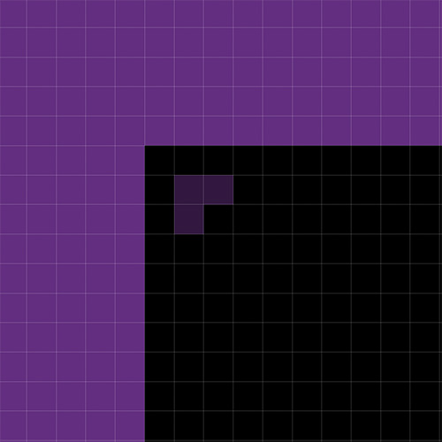
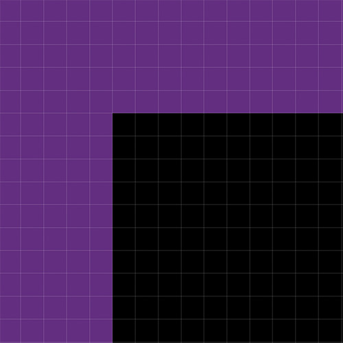

# Betting Tier Image

This is how you should be creating the PNG images needed for the defined betting tiers.

Here are the steps needed:

* Go to [https://rba.jackace.com/](https://rba.jackace.com/)
* Enter the bets for the betting pattern
* Make sure any ads are minimized
* Take a screenshot of the betting pattern, including the following sections
    * Betting Layout
    * Win/Loss per Spot
    * Outcome Graph / Wheel Coverage
* Open up the Photoshop file
* Paste the screenshot in the Photoshop file **at the HIGHEST layer in the Systems layer group
* Make sure the upper left corner matches up with the purple and black 2x2 pixel area in the "Overlays" layer
* Export the image to `PNG`
* Save the file under the `airDate` folder for the system (e.g. `assets/img/systems/2025-05-21/00-rba-0-800x768.png`
    * Each file should be numbered according to the order in the `bettingTier` starting with `0`
    * The first image should be named `00-rba-0-800x768.png`
    * The second image should be named `00-rba-1-800x768.png`
    * The third image should be named `00-rba-2-800x768.png`, etc.
* Put those file names in the `rbaImageUrls` property in the `roulette-systems-20xx.json` file

## Misaligned Layer

## Aligned Layer

